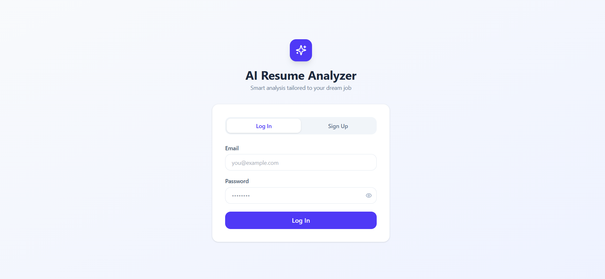
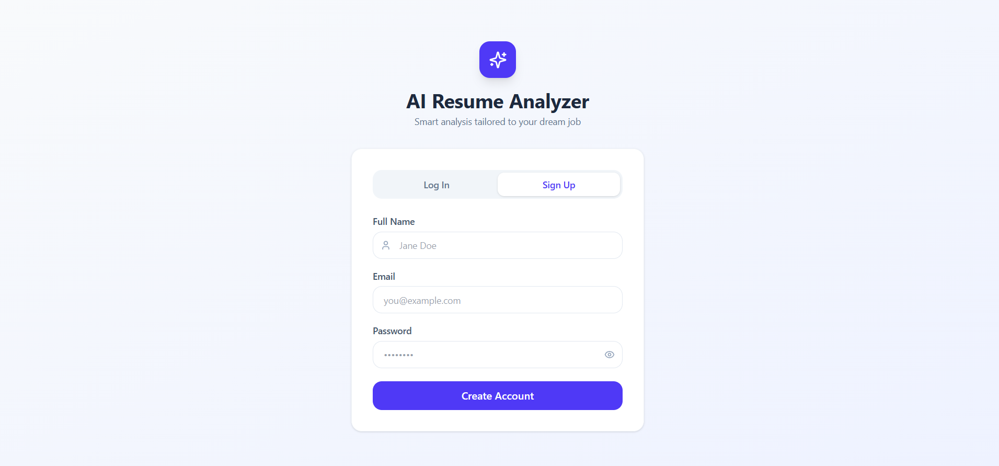
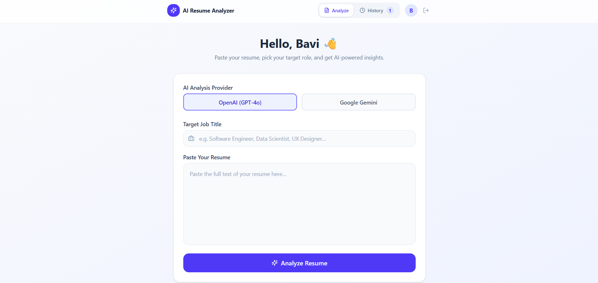
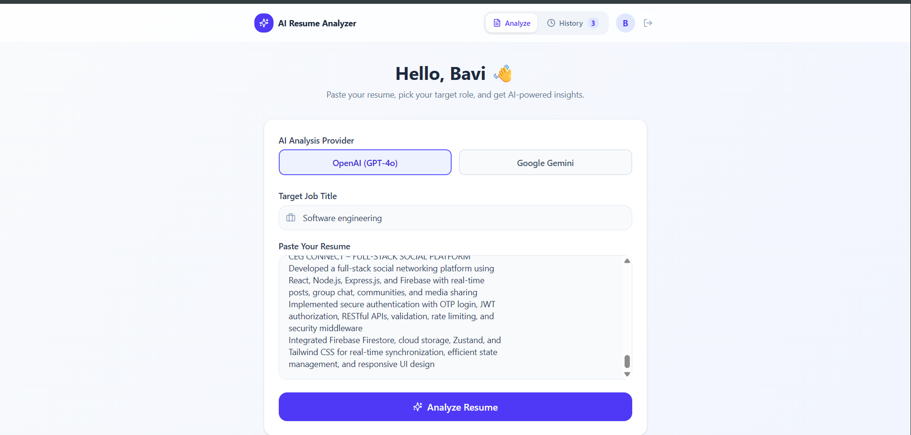
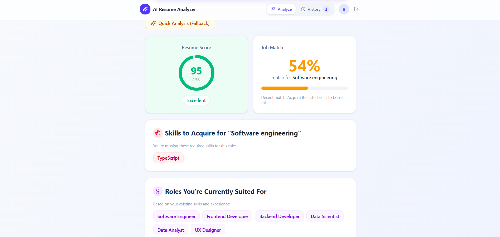
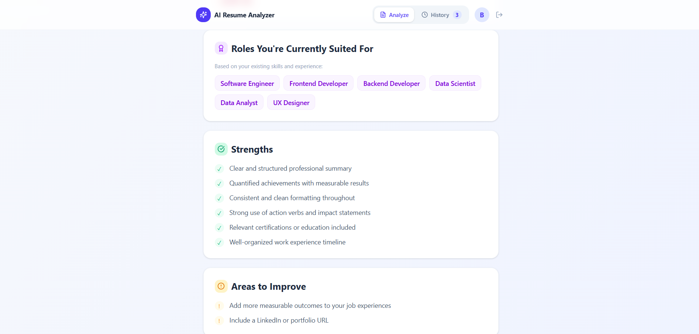
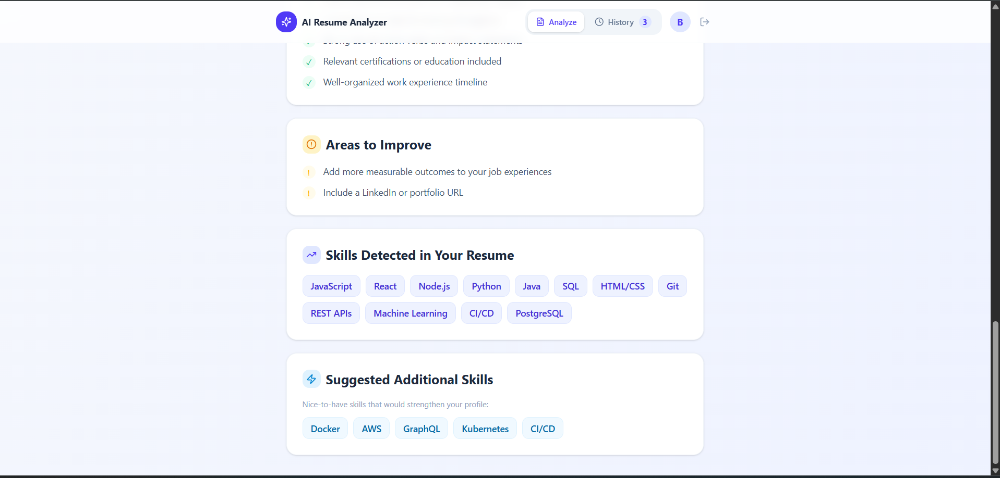
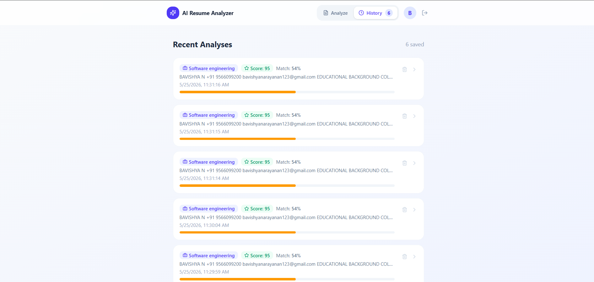

# 🚀 AI Resume Analyzer

Professional AI-powered resume analysis using real NLP models (OpenAI GPT-4o or Google Gemini). Get instant, personalized feedback on your resume with job match scoring and skills gap analysis.

**[Original Design](https://www.figma.com/design/tWWFppL6lrOmpjTiOsRFk9/AI-Resume-Analyzer)**

---


## Screenshots

### Login Page


### Signup Page


### Dashboard


### Resume Upload


### Feedback


### Feedback Details 1


### Feedback Details 2


### History


## ✨ Features

✅ **Real NLP-Powered Analysis** - Not just keyword matching
✅ **Dual AI Provider Support** - OpenAI GPT-4o & Google Gemini
✅ **AI-Powered Analysis** - Advanced contextual understanding
✅ **Resume Scoring** - Get an overall quality score (1-100)
✅ **Job Match Analysis** - See how well you fit target roles (0-100%)
✅ **Skills Detection** - Automatic skill extraction from resume
✅ **Skills Gap Analysis** - Find what you're missing for target roles
✅ **Career Recommendations** - Discover roles you're suited for
✅ **Fallback Mode** - Works without API if needed (keyword matching)
✅ **User History** - Save and track resume analyses
✅ **Beautiful UI** - Modern, responsive design

---

## 📋 Prerequisites

Before you start, make sure you have:
- **Node.js** (v16 or higher) - [Download](https://nodejs.org/)
- **Git** - [Download](https://git-scm.com/)
- **One AI API Key** (choose one):
  - OpenAI API Key - [Get it](https://platform.openai.com/account/api-keys)
  - Google Gemini API Key - [Get it](https://aistudio.google.com/app/apikey)

---

## 🎯 Quick Start (5 minutes)

### Step 1️⃣ Clone the Repository

```bash
git clone https://github.com/navin-ist/resume-analyser.git
cd resume-analyser
```

### Step 2️⃣ Install Dependencies

```bash
npm install
```

### Step 3️⃣ Get Your AI API Key

**Option A: OpenAI (Recommended)**
1. Go to https://platform.openai.com/account/api-keys
2. Click "Create new secret key"
3. Copy the key (format: `sk-...`)
4. Cost: ~$0.01 per resume analysis

**Option B: Google Gemini (Free)**
1. Go to https://aistudio.google.com/app/apikey
2. Click "Create API Key"
3. Copy the key (format: `AIza...`)
4. Cost: Free tier available

### Step 4️⃣ Configure Environment

Create a `.env.local` file in the project root:

```bash
# Windows (PowerShell)
echo "VITE_GEMINI_API_KEY=your_key_here" > .env.local

# Or macOS/Linux
echo "VITE_GEMINI_API_KEY=your_key_here" > .env.local

# Or use OpenAI instead
echo "VITE_OPENAI_API_KEY=sk_your_key_here" > .env.local
```

**⚠️ DO NOT commit `.env.local` to GitHub!** It's in `.gitignore` for safety.

### Step 5️⃣ Start the Dev Server

```bash
npm run dev
```

Go to **http://localhost:5173** in your browser ✅

### Step 6️⃣ Try It Out

1. Paste your resume (minimum 50 characters)
2. Optionally add a target job title
3. Select your AI provider (OpenAI or Gemini)
4. Click "Analyze Resume"
5. Get AI-powered feedback in 5-10 seconds! 🎉

---

## 📖 How to Use

### Basic Analysis (No Job Target)
```
1. Paste resume
2. Click "Analyze Resume"
3. Get overall score, detected skills, and career recommendations
```

### Targeted Job Analysis
```
1. Paste resume
2. Enter target job title (e.g., "Senior React Developer")
3. Click "Analyze Resume"
4. Get job match %, required skills, and improvement suggestions
```

### Switch AI Providers
```
1. Choose "OpenAI (GPT-4o)" or "Google Gemini" button
2. Make sure that provider's API key is in `.env.local`
3. Submit analysis
```

---

## 🏗️ Project Structure

```
resume-analyser/
├── src/
│   ├── services/
│   │   └── aiAnalysisService.ts      ← AI API integration
│   ├── app/
│   │   ├── App.tsx                   ← Main app component
│   │   └── components/
│   │       ├── analyzer.tsx          ← Analysis logic
│   │       ├── auth.tsx              ← User authentication
│   │       ├── history.tsx           ← Resume history
│   │       └── ui/                   ← UI components
│   ├── styles/                       ← Styling
│   └── main.tsx                      ← Entry point
├── .env.example                      ← Environment template
├── API_SETUP.md                      ← Detailed API guide
├── IMPLEMENTATION_SUMMARY.md         ← Technical details
├── package.json                      ← Dependencies
└── vite.config.ts                    ← Build configuration
```

---

## 🔧 Available Commands

```bash
# Install dependencies
npm install

# Start development server (http://localhost:5173)
npm run dev

# Build for production
npm run build

# Preview production build
npm run preview
```

---

## 🚀 Deployment

### Deploy to Vercel (Recommended)

1. **Push to GitHub** (already done ✅)

2. **Go to Vercel:**
   ```
   https://vercel.com/new
   ```

3. **Import Repository:**
   - Choose your GitHub repo
   - Click "Import"

4. **Add Environment Variables:**
   - Go to Settings → Environment Variables
   - Add: `VITE_GEMINI_API_KEY` = your_key
   - Or: `VITE_OPENAI_API_KEY` = your_key

5. **Deploy:**
   - Click "Deploy"
   - Your app is live! 🎉

### Deploy to Netlify

1. **Connect Repository:**
   ```
   https://app.netlify.com/start
   ```

2. **Configure Build:**
   - Build command: `npm run build`
   - Publish directory: `dist`

3. **Add Environment Variables:**
   - Site Settings → Build & deploy → Environment
   - Add your API key

4. **Deploy!**

### Deploy to Other Platforms

See `API_SETUP.md` for Docker and other platform setup.

---

## 📊 What Gets Analyzed

The AI analyzes your resume and provides:

| Metric | Description |
|--------|-------------|
| **Resume Score** | Overall quality (1-100) |
| **Job Match** | Fit for target role (0-100%) |
| **Current Skills** | Detected technical/professional skills |
| **Skill Gaps** | Missing skills for target role |
| **Suggested Skills** | Nice-to-have skills to acquire |
| **Strengths** | What your resume does well |
| **Improvements** | Actionable suggestions |
| **Suited Roles** | Other careers you're well-suited for |

---

## 🔒 Security & Privacy

✅ **Your API Key is Safe**
- Stored locally in `.env.local` (not in GitHub)
- Never exposed in the browser

✅ **Your Resume Data**
- Sent only to AI provider (OpenAI or Google)
- Not stored in our application
- Deleted by provider after 24 hours

✅ **Best Practices**
- Don't commit `.env.local` to GitHub
- Never share your API key
- Use environment variables in production
- Rotate API keys periodically

---

## 💰 Pricing

### OpenAI (GPT-4o-mini)
```
Cost per resume: ~$0.005 - $0.015
Free trial: $5 (enough for 500+ analyses)
Paid plans: Starting from $0.15/1M input tokens
```

### Google Gemini
```
Cost per resume: FREE (on free tier)
Rate limit: 60 requests/day
Paid tier: Available if needed
```

---

## 🆘 Troubleshooting

### Issue: "No API key provided"
```bash
✓ Check .env.local exists in project root
✓ Verify correct API key name (VITE_OPENAI_API_KEY or VITE_GEMINI_API_KEY)
✓ Restart dev server: npm run dev
```

### Issue: "401 Unauthorized"
```bash
✓ Your API key is invalid or expired
✓ Generate a new key from your provider
✓ Update .env.local with new key
✓ Restart dev server
```

### Issue: Rate limit exceeded
```bash
✓ Gemini free tier: 60 req/day (wait 24 hours)
✓ OpenAI: Upgrade plan or use Gemini as backup
✓ Try again in a few minutes
```

### Issue: Analysis falls back to keyword matching
```bash
✓ Check browser console (F12 → Console)
✓ Verify API key is correct
✓ Try the other provider
✓ Check provider's service status
```

---

## 📚 Documentation

- **[API_SETUP.md](./API_SETUP.md)** - Complete API configuration guide with pricing
- **[IMPLEMENTATION_SUMMARY.md](./IMPLEMENTATION_SUMMARY.md)** - Technical implementation details
- **.env.example** - Environment variable template

---

## 🤝 Contributing

Found a bug or have a feature request? 

1. Fork the repository
2. Create a feature branch
3. Make your changes
4. Submit a pull request

---

## 📄 License

This project is provided as-is for educational and personal use.

---

## 🔗 Links

- **GitHub**: https://github.com/navin-ist/resume-analyser
- **Design**: https://www.figma.com/design/tWWFppL6lrOmpjTiOsRFk9/AI-Resume-Analyzer
- **OpenAI**: https://openai.com
- **Google Gemini**: https://gemini.google.com

---

## 💬 Support

For help with:
- **Setup Issues**: Check `API_SETUP.md`
- **OpenAI**: https://help.openai.com/
- **Gemini**: https://support.google.com/ai
- **Technical Issues**: Check browser console (`F12` → Console)

---

## 🎯 Next Steps

1. ✅ Clone the repo (Done!)
2. ✅ Install dependencies (Done!)
3. ⬜ Get API key and add to `.env.local`
4. ⬜ Run `npm run dev`
5. ⬜ Start analyzing resumes!

**Happy analyzing! 🚀**
